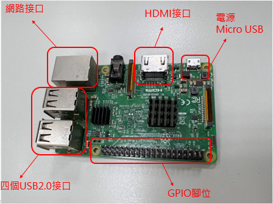
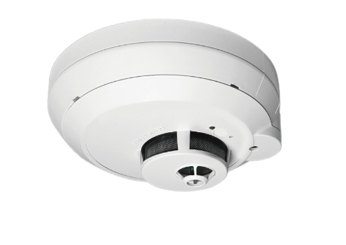

# firetech_server

## 材料
raspberry pi  
  
頂石雲端 CS6000煙溫探測器  
{:height="36px" width="36px"}. 
 

reference :  
[Python 讀取、寫入 XML 格式檔案教學](https://officeguide.cc/python-read-write-xml-format-file-tutorial-examples/)  
[Chart.js 官方文件](https://www.chartjs.org/docs/latest/)  
[How to display dynamic data tables with Python, Flask, and Jinja2](https://www.youtube.com/watch?v=mCy52I4exTU)  
[How to add graphs EASILY to your Flask app(這影片程式碼有錯，但可以聽講解)](https://youtu.be/E2hytuQvLlE)  
[How can I make a link from a <td> table cell](https://stackoverflow.com/a/3337986)  
[【html】如何從<td>表單元格建立連結](https://www.796t.com/post/MXJoMGE=.html)  
[JavaScript Refresh Page with Specific Times Example](https://way2tutorial.com/javascript/example/refresh_page.php)  
[“jinja if else” Code Answer’s](https://www.codegrepper.com/code-examples/whatever/jinja+if+else)
